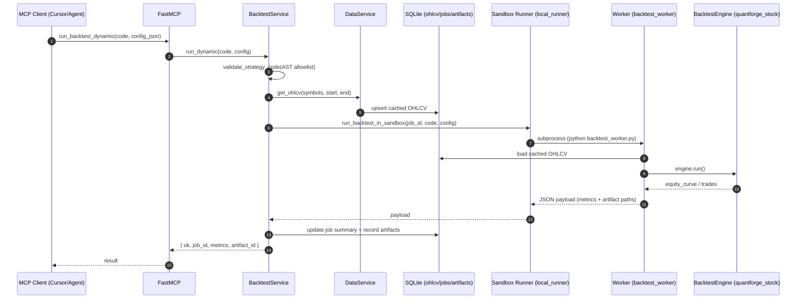

## `quantforge_mcp` 架构总览（MCP 服务器层）

`quantforge_mcp` 是 MCP 服务器本体：负责**配置**、**数据库/仓储**、**服务层**、**工具注册**、**资源（prompt/docs）暴露**，并把 `quantforge_stock` 的回测与分析能力通过 MCP 工具对外提供。

### 模块架构图

```text
quantforge_mcp/
├─ __main__.py                 # python -m quantforge_mcp 启动入口
├─ server.py                   # FastMCP 入口 + 工具/资源注册（stdio/SSE）
├─ config.py                   # QUANTFORGE_* 配置（db/artifacts/transport 等）
├─ codegen/                    # 动态策略 AST 校验（import allowlist）
│  ├─ allowlist.py
│  ├─ validator.py
│  └─ __init__.py
├─ db/                         # SQLite schema/连接/仓储
│  ├─ schema.sql
│  ├─ connection.py
│  └─ repositories/
│     ├─ ohlcv_repo.py
│     ├─ job_repo.py
│     ├─ artifact_repo.py
│     └─ __init__.py
├─ services/                   # 领域服务：数据/回测/报告
│  ├─ data_service.py
│  ├─ backtest_service.py
│  ├─ report_service.py
│  ├─ _formatters.py
│  └─ __init__.py
├─ tools/                      # MCP tools：对外的函数接口
│  ├─ data_tools.py
│  ├─ backtest_tools.py
│  └─ __init__.py
├─ resources/                  # MCP resources：prompt/spec/索引资源
│  ├─ codegen_spec.md
│  ├─ symbol_guide.md
│  ├─ compute_resources.py
│  ├─ strategy_resources.py
│  └─ __init__.py
├─ schemas/                    # Pydantic 模型：config/summary/validation 等
│  ├─ strategy.py
│  ├─ backtest.py
│  ├─ data.py
│  ├─ indicator.py
│  └─ __init__.py
└─ sandbox/                    # 子进程 runner + worker（本地隔离执行回测）
   ├─ local_runner.py
   ├─ __init__.py
   └─ worker/
      └─ backtest_worker.py
```

### 入口与生命周期

- **`quantforge_mcp/server.py`**：服务入口
  - 创建 `FastMCP("quantforge")`
  - 初始化 `MCPSettings`、SQLite schema
  - 实例化 `DataService` / `BacktestService` / `ReportService`
  - 注册工具与资源（tools/resources）
  - **stdio**：`mcp.run(transport="stdio")`
  - **SSE**：使用 `uvicorn` 托管 `mcp.sse_app()`（兼容不同版本 `mcp` 的 `FastMCP.run()` 参数差异）

### 配置（env → settings）

- **`quantforge_mcp/config.py`**
  - `MCPSettings`（`QUANTFORGE_` 前缀）
  - **默认 `storage/` 路径相对当前工作目录（cwd）**解析，适配 `uvx/pipx` 场景（site-packages 不可写）
  - 关键项：
    - `db_path` / `artifacts_dir`
    - `data_source` / `akshare_adjust` / `allow_synthetic_fallback`
    - `sandbox_timeout_sec`
    - `transport` / `sse_port`

### DB 与仓储（SQLite）

- **`quantforge_mcp/db/connection.py`**：`SQLiteManager`
  - 打开连接、初始化 schema（`quantforge_mcp/db/schema.sql`）
- **`quantforge_mcp/db/repositories/*`**
  - `OhlcvRepository`：行情缓存（OHLCV）
  - `JobRepository`：回测任务记录（job、状态、summary）
  - `ArtifactRepository`：产物索引（equity_curve、trades、stdout/stderr、report 等路径）

### 服务层（领域逻辑）

- **`quantforge_mcp/services/data_service.py`**：数据获取与缓存
  - 判断 A 股/非 A 股，路由到 `akshare` / `yfinance`
  - 可用 `allow_synthetic_fallback` 在拉取失败时回退合成数据（便于演示/调试）
- **`quantforge_mcp/services/backtest_service.py`**：动态策略回测编排
  - 校验策略代码（AST allowlist）
  - 拉取并确保缓存数据存在
  - 调用 sandbox 子进程执行回测
  - 写入 job summary 与 artifacts 索引
- **`quantforge_mcp/services/report_service.py`**：报告生成
  - 从 equity_curve 读取，生成 Markdown tearsheet
  - 产物记录为 `report_markdown`

### Sandbox 执行（子进程隔离）

- **`quantforge_mcp/sandbox/local_runner.py`**
  - 把策略代码与 config 写入 `artifacts/job_id/`
  - `subprocess.run()` 启动 worker，超时由 `sandbox_timeout_sec` 控制
- **`quantforge_mcp/sandbox/worker/backtest_worker.py`**
  - 从 SQLite 读取缓存行情
  - 构建 `BacktestEngine` 并执行
  - 输出 equity/trades，并打印 JSON payload 给父进程解析

### MCP 工具（tools）

- **`quantforge_mcp/tools/data_tools.py`**
  - `get_stock_data`
  - `list_cached_symbols`
  - `prefetch_stock_data`
- **`quantforge_mcp/tools/backtest_tools.py`**
  - `validate_strategy_code`
  - `validate_backtest_config`
  - `run_backtest_dynamic`
  - `list_backtest_jobs` / `get_backtest_result`
  - `generate_backtest_report` / `get_backtest_artifacts`

### MCP 资源（resources）

资源主要用于“给智能体/用户读的 prompt 与参考资料”：

- **`quantforge_mcp/resources/codegen_spec.md`**：动态策略写法规范（含 allowlist/import 约束、config 示例、workflow）
- **`quantforge_mcp/resources/symbol_guide.md`**：symbol 与数据源说明
- **`quantforge_mcp/resources/compute_resources.py`**：计算模块索引（参考目录）
- **`quantforge_mcp/resources/strategy_resources.py`**：内置策略示例索引与源码展示

### 一条动态回测的“调用链”

1. MCP Client 调用 `run_backtest_dynamic(code, config_json)`
2. `BacktestService.run_dynamic` 校验 code/config
3. `DataService.get_ohlcv` 确保缓存数据准备好（落 SQLite）
4. `sandbox/local_runner.py` 写 job 目录并起 worker
5. `sandbox/worker/backtest_worker.py` 读取 SQLite → `BacktestEngine.run()`
6. worker 写 artifacts（csv/md 等），父进程写入 job summary + artifacts 索引
7. 客户端可用 `get_backtest_result` / `list_backtest_jobs` / `get_backtest_artifacts` 获取结果与产物

## 工作流程图（动态回测）



## 后续更新计划（Roadmap）

- **完善 ML 机器学习模块（开发 → 可用）**
  - 明确实验开关与依赖边界
  - 将可稳定复用的特征/因子/模型接口沉淀为对外 API
- **添加 Docker 沙盒 / Worker 隔离**
  - 支持以容器方式运行 `backtest_worker`（资源隔离、依赖可控、便于部署）
  - 为本地子进程与 Docker 两种 runner 提供一致的配置与回传协议
- **发布到 PyPI**
  - 支持 `uvx quantforge-mcp==<version>` 直接启动
  - 建议采用 GitHub Actions Trusted Publishing（OIDC）实现自动化发布

